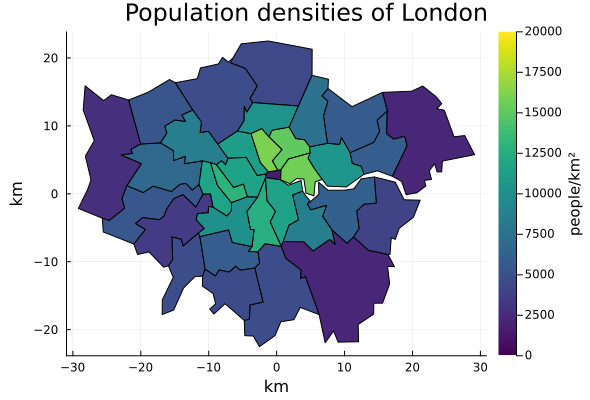
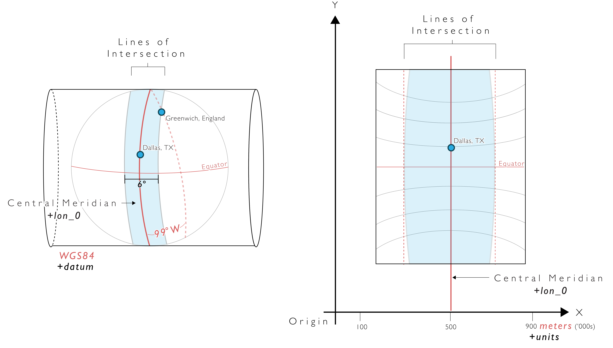

## Population distributions and densities

Population distributions:

<p align="center">
  
</p>

Population densities:
<p align="center">
  
</p>

## About

This was an attempt to create geospatial visualization and manipulation functions in Julia inspired by Python's Rasterio package. 

This repository relies on Rasters.jl for reading raster data and some data manipulation.
Personally I am not a big fan of many of the design choices in Rasters.jl or the related DimensionalData.jl package.
However it is the best available in the ecosystem.

All projections are done with custom functions instead of with ArchGDAL.jl. 
The `reproject` function in particular is redefined here.
This was partly because of a lack of adequate documentation on reprojection, partly because I didn't know how else to integrate these functions with the `ImageTransformations.warp` function and partly because I wanted to experiment with the raw mathematics.

The consequence of this is that this project is therefore very limited in the projections it can handle.
In particular, only the spherical (normal) version of the projections are available here.
In the future I would like to add the ellipsoidal versions too and make those the default.

Supported projections:
- Cylindrical equal area (spherical)
- Mercator (spherical)
- Transverse mercator (spherical)

## Correcting distortions

The input data for the most part is in WGS 1984 co-ordinates. That is, latitude and longitude on a spheroid approximation of the earth. This spheroid very closely resembles a sphere, with the z radius about 297/298 times smaller than the x and y radii. (The x and y radii are equal on a spheroid.) 

Plotting these directly results in the [equirectangular projection](https://en.wikipedia.org/wiki/Equirectangular_projection). 
This projection preserves lines of latitude but stretches apart lines of longitude.
At the extreme, the poles are stretched from a single point to a line as long as the equator.
Shapes will appear stretched in the x-direction.
This stretching factor can be calculated as `cos(latitude)`.

For small regions this can be corrected by assuming a single stretch factor e.g. for the middle line of latitude in the region of interest.

<figure align="center">
  
  <figcaption> Source: <a href="https://pygis.io/docs/d_understand_crs_codes.html">pygis.io/docs/d_understand_crs_codes.html</a>.</figcaption>
</figure>

A more robust method is to use a [transverse mercator projection](https://en.wikipedia.org/wiki/Transverse_Mercator_projection).
This wraps a cylinder around the earth. 
It then (1) projects points on to this cylinder and (2) stretches them out in both the `x` and `y` direction so that the mapping is conformal. That is, the object retains its shape.
The central longitude directly on the cylinder is fully preserved.
A third step is often added to convert this spherical projection to an ellipsoid projection.

Note that in this projection the units are not earth distances. Rather, they are earth distances multiplied by some stretch factor. However very close to the central longitude this stretch factor is approximately 1, so for a small region about it they are approximately earth distances.

## Set up (optional)

```
julia> ] # enter package mode
(@v1.x) pkg> activate .
(@v1.x) pkg> instantiate # install everything in Project.toml
(@v1.x) pkg> status # verify installations
```

## Data Sources

Country and administrative boundaries from https://www.geoboundaries.org/. 
Runfola, D. et al. (2020) geoBoundaries: A global database of political administrative boundaries. PLoS ONE 15(4): e0231866. https://doi.org/10.1371/journal.pone.0231866

Country populations from https://hub.worldpop.org/.
WorldPop (www.worldpop.org - School of Geography and Environmental Science, University of Southampton;
Department of Geography and Geosciences, University of Louisville; Departement de Geographie, Universite
de Namur) and Center for International Earth Science Information Network (CIESIN), Columbia University
(2018). Global High Resolution Population Denominators Project - Funded by The Bill and Melinda Gates
Foundation (OPP1134076). https://dx.doi.org/10.5258/SOTON/WP00675

World.tif raster from https://github.com/yeesian/ArchGDALDatasets/.